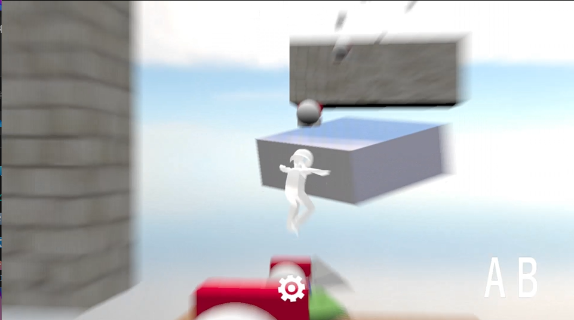

# MPEngine

## エンジンのこだわり
### アプリケーション特化
アプリケーションの早期実装に重きを置いて制作しており、ModelやSprite等のリソース描画をフラグで管理し、直接DrawCollを呼び出さずとも自動で描画されるようになっています。

アプリケーション以外にもエディタや、他のゲームプロジェクトを作ることを想定とした作りになっており、基底クラスのGameFrameを使うことで簡単に切り分けることが出来ます。

### 衝突判定の最適化
(後回しにしているため予定です)

コライダーのタイプを設定し、それに応じた衝突判定が半自動的に呼び出される仕組みになっています。Boxでの衝突判定の場合、回転があるのならOBB、ないのであればAABBになるよう自動で切り替わるよう最適化されています。
今後は先にSphereで衝突判定を取ってからBoxで取ったり、四分木を使って衝突判定自体を減らす予定です。

## プログラム説明

### 衝突判定の最適化
説明しよう！！ほにゃららである

## 外部ライブラリ
### [externals フォルダに収納](https://github.com/hamu4792game/MPEngine_ver2.0/tree/master/Solution/externals)
 - [DirectXTex](https://github.com/microsoft/DirectXTex)
 - [ImGui](https://github.com/ocornut/imgui)
 - [Assimp](https://github.com/assimp/assimp)
 - [nlohmann](https://github.com/nlohmann/json)

---

# アプリケーション

## ゲーム紹介：「疾走」

### 概要
* ジャンル : 3Dアクション
* プレイ人数 : 1人
* 制作人数 : 1人
* 制作環境 : DirectX12 / Windows SDK ver_10.0.22621.0

### 紹介
このゲームは「Marvel's Spider-Man」を参考にし、プレイヤーがワイヤーで、ターゲットの位置に移動したり、振り子挙動のようにスイングをしながら、起伏が激しいステージを自由に移動するゲームとなっています。

プレイヤーの手触りがよく、疾走感あふれるビュンビュンとした動きをお楽しみください

## 制作者のこだわり
このゲームは[「Marvel's Spider-Man」](https://store.steampowered.com/app/1817070/Marvels_SpiderMan_Remastered/?l=japanese)を参考にし、カメラワークとプレイヤーの手触りを重視し作られています。

## プログラム説明

### カメラワーク
疾走感あふれるカメラワークを作ることに重視しています。プレイヤーの速度によってカメラとの距離を変えたり、遅延を入れるための補間を上手く扱って違和感がないようにしています

### プレイヤー
手触りが良くなるよう、移動方法にも工夫を入れています
- ワイヤー移動
- ウェブスイング
- 通常移動
